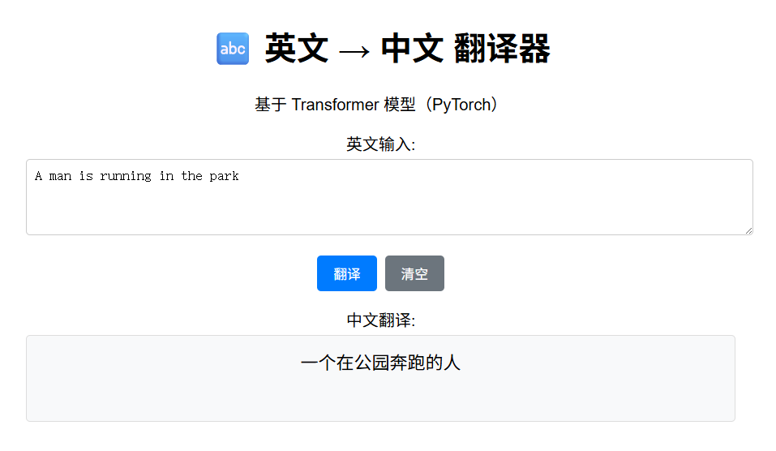

# Transformer 英中翻译模型(WIP)

基于Transformer架构的英中翻译模型，使用29,000个训练样本和1,000个验证样本。

## 项目结构
```text
translate-transformer/
├── data/ # 数据目录
├── src/ # 源代码
├── scripts/ # 辅助脚本
├── vocab_new/ # 词汇表
├── checkpoints_new/ # 模型检查点
├── logs_new/ # TensorBoard日志
├── requirements.txt # 依赖包
└── README.md # 说明文档
```

## 快速开始
```bash
1. 安装依赖
pip install -r requirements.txt

2. 准备数据
将训练数据放在 data/ 目录下：
train.en: 英文训练数据 (29,000句)
train.zh: 中文训练数据 (29,000句)
val.en: 英文验证数据 (1,000句)
val.zh: 中文验证数据 (1,000句)

3. 构建词汇表
bash
python scripts/build_vocab.py

4. 训练模型
bash
python src/train.py

5. 测试翻译
bash
python src/inference.py


配置说明
在 src/config.py 中可以调整以下参数：
模型参数: D_MODEL, N_HEAD, NUM_LAYERS 等
训练参数: BATCH_SIZE, EPOCHS, LEARNING_RATE 等
数据参数: MAX_LENGTH, MAX_VOCAB 等

模型架构
编码器: 4层Transformer编码器
解码器: 4层Transformer解码器
词嵌入: 256维
注意力头: 8头注意力
前馈网络: 1024维

训练技巧
标签平滑: 防止过拟合

学习率调度: Cosine Annealing
早停机制: 验证损失不再下降时停止
梯度裁剪: 防止梯度爆炸

结果评估
训练完成后，可以使用以下命令查看训练曲线：

bash
tensorboard --logdir logs_new/


## 使用方法
# 给执行权限
chmod +x run_training.sh

# 一键训练
./run_training.sh

# 或者分步执行
python scripts/build_vocab.py
python src/train.py
python src/inference.py
```

### BLEU Score
```bash
🎉 最终 BLEU 分数 (tokenize='zh'): 36.13
详细信息: BLEU = 36.13 69.2/48.0/34.3/25.5 (BP = 0.875 ratio = 0.882 hyp_len = 15792 ref_len = 17898)
```

# frontend backend


### backend
```bash
# 1. build docker image:
docker build -f ./backend/Dockerfile -t backend-app:9 .
# 2. run 
docker run -d   --name translate   -v <model dir on host dir>:<container dir>/:ro   -v <val dir on host dir>:<container dir>:ro   -p 8000:8000   --gpus all   backend-app:9
```
### frontend
```bash
# 1. change frontend dir
cd frontend/
# 2. build docker image:
docker build -f Dockerfile -t front-end:1 .
# 2. run 
docker run -d   --name translate-frontend -p 3000:3000   --gpus all   front-end:1
```
