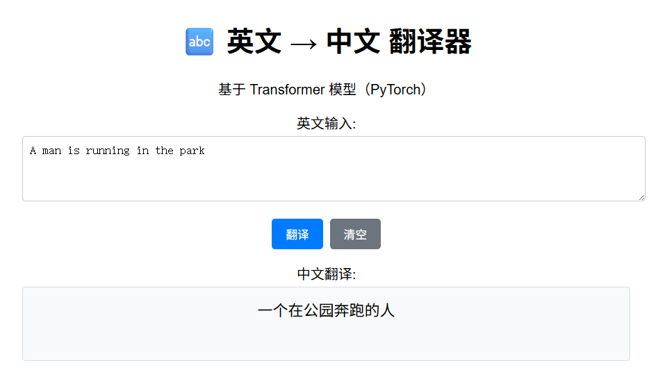

# Transformer 英中翻译模型

基于 Transformer 架构的英中翻译系统，使用 PyTorch 实现，包含完整的训练流程和 Web 应用界面。

## 项目特点

- **完整的翻译系统**: 包含模型训练、推理、评估和 Web 服务
- **现代化架构**: 基于 Transformer 的编码器-解码器结构
- **SentencePiece 分词**: 使用 SentencePiece 进行子词分词
- **Web 应用**: 前后端分离的 React + FastAPI 应用
- **Docker 支持**: 提供容器化部署方案

## 项目结构

```
translate-transformer/
├── data/                    # 训练和验证数据
├── src/                     # 核心源代码
│   ├── config.py           # 配置文件
│   ├── model.py            # Transformer 模型实现
│   ├── train.py            # 训练脚本
│   ├── inference.py        # 推理脚本
│   ├── dataset.py          # 数据集处理
│   ├── tokenizer.py        # 分词器
│   └── utils.py            # 工具函数
├── scripts/                 # 辅助脚本
│   ├── build_vocab.py      # 词汇表构建
│   └── train_tokenizer.py  # 分词器训练
├── backend/                 # FastAPI 后端服务
├── frontend/                # React 前端应用
├── vocab_new/               # 词汇表文件
├── checkpoints_new/         # 模型检查点
├── logs_new/                # TensorBoard 日志
├── model-ga/                # 部署模型文件
├── requirements.txt         # Python 依赖
└── run_training.sh          # 一键训练脚本
```

## 快速开始

### 环境要求

- Python 3.8+
- PyTorch 2.0+
- CUDA (可选，用于 GPU 加速)

### 安装依赖

```bash
pip install -r requirements.txt
```

### 数据准备

将训练数据放置在 `data/` 目录下：
- `train.en` - 英文训练数据
- `train.zh` - 中文训练数据
- `val.en` - 英文验证数据
- `val.zh` - 中文验证数据

### 一键训练

```bash
# 给脚本执行权限
chmod +x run_training.sh

# 运行训练流程
./run_training.sh
```

### 分步执行

```bash
# 1. 构建词汇表
python scripts/build_vocab.py

# 2. 训练模型
python src/train.py

# 3. 测试推理
python src/inference.py
```

## 模型架构

| 参数 | 值 |
|------|-----|
| 编码器层数 | 4 |
| 解码器层数 | 4 |
| 词嵌入维度 | 512 |
| 注意力头数 | 8 |
| 前馈网络维度 | 1536 |
| Dropout | 0.15 |
| 最大序列长度 | 80 |
| 词汇表大小 | 28,000 (英文) / 16,000 (中文) |

## 训练配置

在 `src/config.py` 中可以调整以下参数：

- **模型参数**: `D_MODEL`, `N_HEAD`, `NUM_ENCODER_LAYERS` 等
- **训练参数**: `BATCH_SIZE`, `EPOCHS`, `INIT_LR`, `MAX_LR` 等
- **数据参数**: `MAX_LENGTH`, `MAX_VOCAB` 等

### 训练技巧

- **标签平滑**: Label Smoothing = 0.15，防止过拟合
- **学习率调度**: Transformer 风格的 Warmup + Cosine Annealing
- **早停机制**: 验证损失不再下降时停止训练
- **梯度裁剪**: 防止梯度爆炸

## 评估结果

```
BLEU 分数: 36.13
详细信息: BLEU = 36.13 69.2/48.0/34.3/25.5 (BP = 0.875 ratio = 0.882 hyp_len = 15792 ref_len = 17898)
```

查看训练曲线：

```bash
tensorboard --logdir logs_new/
```

## Web 应用

项目提供了一个完整的 Web 翻译应用，包含前后端。



### 后端服务

```bash
# 构建 Docker 镜像
docker build -f ./backend/Dockerfile -t backend-app:9 .

# 运行容器
docker run -d \
  --name translate \
  -v <模型目录>:<容器目录>:ro \
  -v <验证数据目录>:<容器目录>:ro \
  -p 8000:8000 \
  --gpus all \
  backend-app:9
```

### 前端应用

```bash
# 进入前端目录
cd frontend/

# 构建 Docker 镜像
docker build -f Dockerfile -t front-end:1 .

# 运行容器
docker run -d \
  --name translate-frontend \
  -p 3000:3000 \
  --gpus all \
  front-end:1
```

访问 http://localhost:3000 使用翻译服务。

## API 接口

### 翻译接口

**POST** `/translate`

请求体：
```json
{
  "text": "Hello, how are you?",
  "temperature": 0.8
}
```

响应：
```json
{
  "translation": "你好，你好吗？"
}
```

## Kubernetes 部署

项目支持 Kubernetes 集群部署，配置文件位于 `k8s/` 目录。

```bash
# 部署后端
kubectl apply -f k8s/backend.yaml

# 部署前端
kubectl apply -f k8s/frontend.yaml

# 配置 Ingress
kubectl apply -f k8s/ingress.yaml
```

## 参考资料

- [Attention Is All You Need](https://arxiv.org/abs/1706.03762)
- [PyTorch Transformer 文档](https://pytorch.org/docs/stable/nn.html#transformer)
- [SentencePiece](https://github.com/google/sentencepiece)

## 许可证

本项目仅供学习和研究使用。
